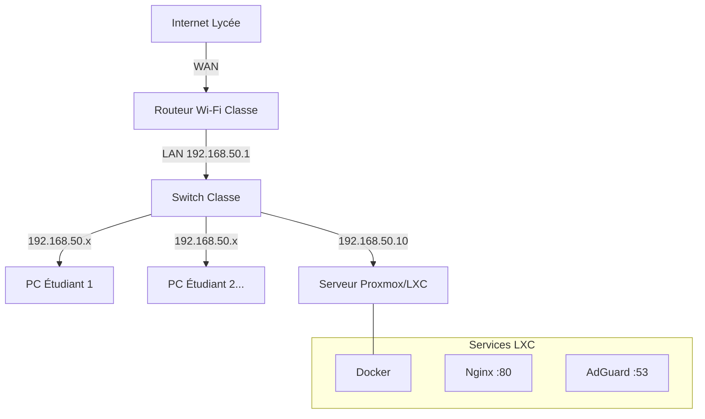

# 🚀 GUIDE DE MISE EN PRODUCTION - SERVEUR CIEL

> **Objectif** : Déployer l'infrastructure sur un serveur Proxmox pour une classe de 20 PC (4 îlots de 5).

---

## 1. ARCHITECTURE RÉSEAU (CLASSE)

Pour isoler la classe et garantir le fonctionnement des noms de domaine (`ciel.lan`), nous utilisons un routeur dédié.



### Plan d'Adressage
*   **Réseau** : `192.168.50.0/24`
*   **Passerelle (Routeur)** : `192.168.50.1`
*   **Serveur (IP Fixe)** : `192.168.50.10`
*   **Plage DHCP Élèves** : `192.168.50.100` à `.200`
*   **DNS Primaire (Distribué par DHCP)** : `192.168.50.10` (IMPORTANT !)

---

## 2. PRÉPARATION PROXMOX (LXC)

1.  **Créer un CT (Conteneur)** :
    *   **Template** : `debian-12-standard`
    *   **Disque** : 20 Go min.
    *   **CPU/RAM** : 2 Cores / 2 Go RAM.
    *   **Réseau** : Bridge (vmbr0), IP Statique IPv4/CIDR : `192.168.50.10/24`, Gateway : `192.168.50.1`.

2.  **Activer le Nesting (CRITIQUE pour Docker)** :
    *   Une fois créé, allez dans Proxmox > Votre CT > **Options** > **Features**.
    *   Cochez **Nesting**.
    *   Redémarrez le conteneur.

---

## 3. INSTALLATION

### A. Transfert des fichiers
Depuis votre PC de dev, envoyez le dossier `Serveur_Ciel` vers le serveur (via WinSCP, FileZilla ou scp).
*   **Destination** : `/root/Serveur_Ciel`

### B. Lancement Automatique
Connectez-vous au serveur en SSH ou via la Console Proxmox :

```bash
cd /root/Serveur_Ciel
chmod +x install.sh
./install.sh
```

> ☕ Le script va tout installer (Docker, mises à jour) et lancer les services.

---

## 4. FINALISATION (Dernière étape manuelle)

Une fois le script terminé, il faut configurer **AdGuard Home** pour qu'il redirige `ciel.lan` vers votre serveur.

1.  Connectez-vous à **http://192.168.50.10:3000**.
2.  Suivez l'assistant (Écoute interface Web : tout, Port 3000 / Écoute DNS : tout, Port 53).
3.  Allez dans **Filtres** > **Réécritures DNS**.
4.  Ajoutez une règle :
    *   Domaine : `*.ciel.lan`
    *   Réponse : `192.168.50.10`
5.  Ajoutez une règle (sécurité) :
    *   Domaine : `ciel.lan`
    *   Réponse : `192.168.50.10`

---

## 5. VÉRIFICATION ÉLÈVE

Sur un PC élève connecté au routeur (et ayant reçu l'IP DNS 192.168.50.10) :
1.  Ouvrir le navigateur.
2.  Taper `http://ciel.lan` -> Doit ouvrir Heimdall.
3.  Taper `http://files.ciel.lan` -> Doit ouvrir FileBrowser.
